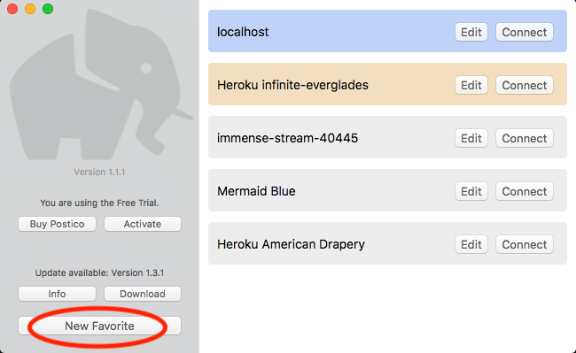
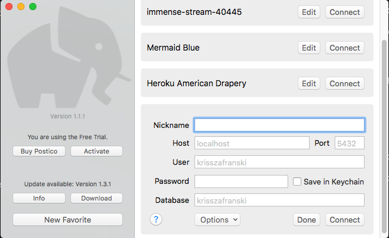
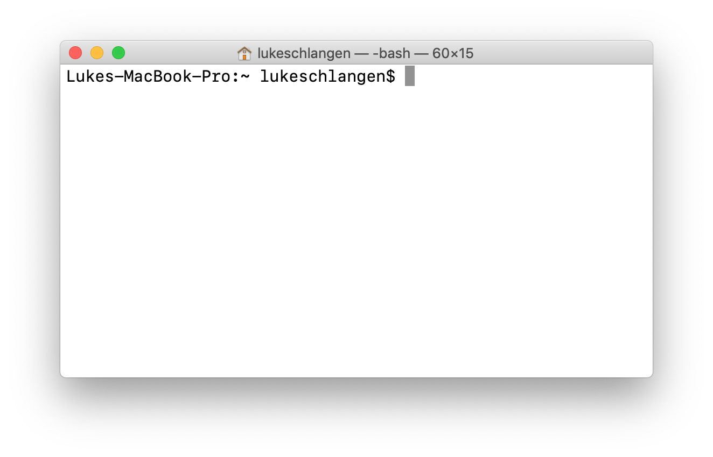
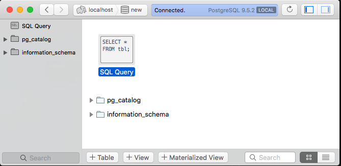

# Postgres and Postico Install
*Last updated 1/2018*

## Postgres Overview

Postgres is an SQL database. This guide merely shows you how to install the software needed to run Postgres. Actual lectures on using Postgres will follow.

### Prerequisites
You have previously installed Homebrew, the package manager for Mac OS.
To check if you have recently updated Homebrew.

1. Open a terminal
2. Type: `brew update`
3. Press enter key

## Install Brew (if you don’t already have it)

First you need to get brew. You can test if you have brew with this command:

`$ which brew`

if it logs

`/usr/local/bin/brew`

then you are all set and can go to the next step!

If you don't have it follow the install instructions on http://brew.sh/ . You will need to run a run command in your terminal. Come find an instructor if you have permissions issues. 

## Installing Postgres

1. Open a terminal and run this command: `$ brew install postgres`

### Starting/Stopping Postgres (Option 1 of 2)

If you have installed Postgres with Homebrew, you can use the built-in Brew Services commands to start/stop the server as below:

- Stop the server: `$ brew services stop postgresql`
- Start the server: `$ brew services start postgresql`
- See what is running: `$ brew services list`

### Starting/Stopping Postgres (Option 2 of 2)

This method gives you a log of errors like node does. As the server receives requests and runs queries, it will give you output in the terminal.

- In your terminal, run: `$ postgres -D /usr/local/var/postgres` to start Postgres using the specified file location as a data directory
- To **stop** Postgres, press the control and C keys at the same time

#### Create an Environment Variable Postgres (optional)

You might find it inconvenient to start postgres by typing in all of that stuff. You can make your life easier, by setting a PGDATA environment variable.

1. In terminal, run: `$cd ~` to navigate to your user’s directory
2. Open and/or create a file named .bash_profile
3. Add the following line to the file: 
    `export PGDATA="/usr/local/var/postgres"`
4. Save the file.
5. Close the terminal window.
6. Open a new terminal window (to see the changes take effect).
7. Run `$ postgres` to start your database.

## Postico (Database Client GUI app) Overview

At this point we will have a Postgres server program running on our local computer. We’re now going to install a graphical Client so we can have a fancy way to interact with our new server software. If this doesn’t work, please read to the end of the instructions to try these things before asking questions! We have solutions for several common problems.

### Install Postico

1. Go to: https://eggerapps.at/postico/
2. Download
3. Unzip and move to your Applications folder
4. Open (double-click Postico icon)

First thing we need to do is establish a connection to our server. Postico allows you to save many different connections. For now, we just need one to connect to the database server on our local computer.

### Create New Favorite

1. Click New Favorite

2. Fill in this form as follows:

- **Nickname** can be anything. For now use `Localhost` or `Local`
- **Host** Needs to be `localhost` as this runs on our local computer
- **Port** Leave at the default of `5432`
- **User** This needs to be the user account name that installed Postgres. The default should be good.
    - You can find your username in your terminal:

- **Password** If you followed the above installation of Postgres, this can be left blank
- **Database** By default, Postgres creates a database called whatever your username is. Here `lukeschlangen` is Luke Schlangen's username.

### Create a Database

**IMPORTANT: Only complete the following steps if you get an error when you try to connect stating this database does not exist.**

#### To manually create your database

1. In terminal, run `$ createdb your_username_here`

If yours was `lukeschlangen` you would type: `createdb lukeschlangen`

## Confirm Everything is Working

Now back in Postico you should be able to connect to the host: localhost with a database called your username.

1. Open Postico
2. Connect to the `Local` that you just created (the `connect` button). 
3. You should see something like this:

